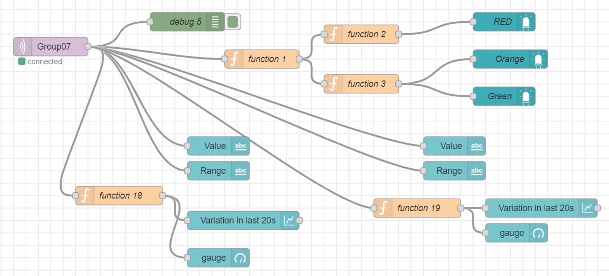
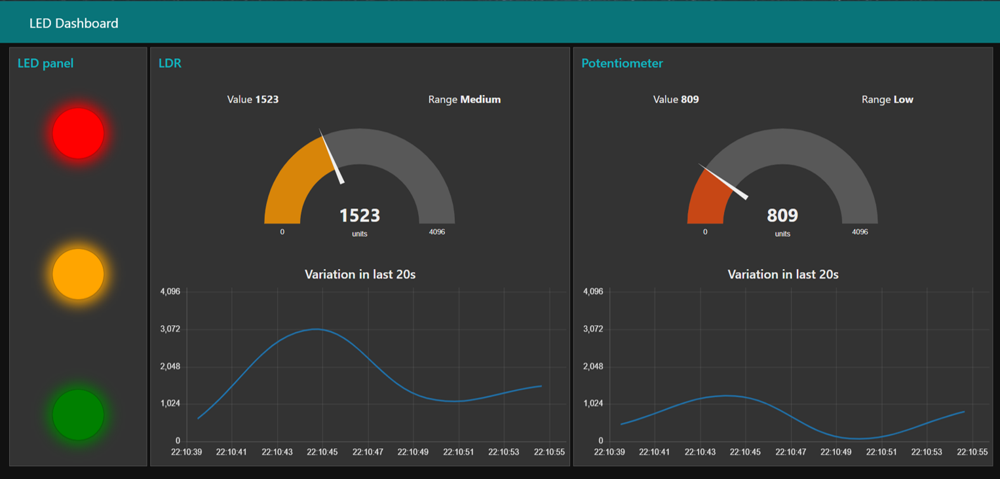
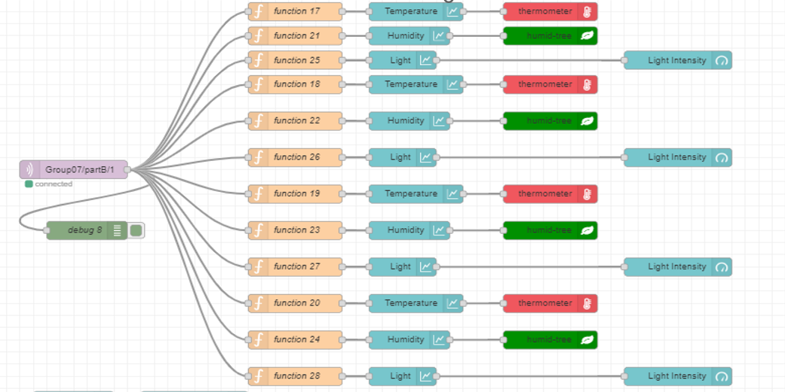
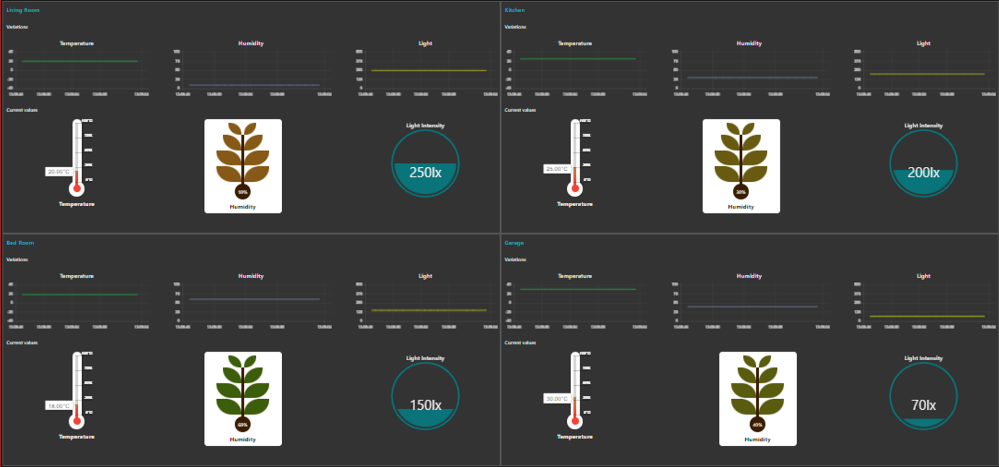

# Implementation of transferring information via MQTT using JSON objects

These repository investigates the implementation of transferring information via MQTT using JSON objects. To achieve this two procedures are followed. 
##### 1. Part A
Reading sensor values in an IoT node, converting them into a JSON object, and transmitting it to another IoT node  to controlling the device in that IoT node. 
##### 2. Part B
reading data from an existing database, converting it into a JSON format, and publishing it to a broker.

In addition, this lab demonstrates how to develop a user interface to
analyze data received from a broker using Node-RED platform

## Part A
### Task 1
#### Node A

We utilized an ESP32 microcontroller for our project, employing Pin 34 (analog) to interface with a potentiometer and Pin 35 (analog) to connect with a Light-Dependent Resistor (LDR). In our setup, one terminal of the potentiometer is grounded, while the other is connected to a Vin pin, providing a 5V supply voltage.

For the LDR, our circuit design is such that it yields a high output when exposed to high light intensity, corresponding to low resistance in the LDR. To achieve this, the LDR is connected in series with a fixed resistor. We measure the voltage difference across the resistor as our input signal, which serves as an effective indicator of ambient light levels.

#### Node B
This node consisting of three LEDs as outputs (Physical LED Dashboard) and we used a NodeMCU board as the microcontroller. NodeMCU board receive sensor values from the broker and dives LEDs accordingly.

Since LEDs output digital values we selected 3 GPIO pins on NodeMCU to connect LEDs.
Pin arrangement:

- LED Red: 		GPIO 5 (D1) and GND

- LED Orange:		GPIO 4 (D2) and GND

- LED  Green: 		GPIO 0 (D3) and GND

### Task 2
#### Dividing Potentiometer and LDR Ranges in Node A:
we have divided the range of values that the potentiometer and LDR (Light Dependent Resistor) can provide into three distinct modes: Low, Medium, and High.
##### Potentiometer:
- Low Mode: When the potentiometer's resistance falls within the lower part of its range, we classify it as "Low."
- Medium Mode: In the middle range of the potentiometer's resistance values, we designate it as "Medium."
- High Mode: When the potentiometer's resistance is in the upper range, we identify it as "High."

##### LDR (Light Dependent Resistor):
- Low Mode: When the LDR's resistance is high due to low light levels, it falls into the "Low" category.
- Medium Mode: In moderate lighting conditions, where the LDR's resistance is moderate, we label it as "Medium."
- High Mode: When the LDR's resistance is low due to high light intensity, it corresponds to the "High" mode.

#### Publishing sensor reading to the broker
- MQTT broker:		"broker.hivemq.com"
-  Port:			1883
-  JSON object format: 
  {"POTvalue":2269,"LDRvalue":103,"POT":"Medium","LDR":"Low"}

#### Activation LEDs at Node B
Node B has subscribed to the same topic that Node A publishing and according to the value of POT and LDR, LEDs are activated.
| Pot value | LER value | Red LED | Orange LED | Green LED |
|-----------|-----------|---------|------------|-----------|
| Low       | Low       | Blinking| Blinking   | Blinking  |
| Low       | Medium    | Blinking| Blinking   | Blinking  |
| Medium    | Low       | Blinking| Blinking   | Blinking  |
| Medium    | Medium    | OFF     | ON         | ON        |
| High      | Low       | OFF     | ON         | ON        |
| Low       | High      | OFF     | ON         | ON        |
| High      | Medium    | ON      | ON         | ON        |
| Medium    | High      | ON      | ON         | ON        |
| High      | High      | ON      | ON         | ON        |

### Task 3
#### Node-Red Dashboard
- Replicate LED dashboard.
- Show the Potentiometer and LDR readings of the most recent 20s as charts.

##### Node-Red flow

##### Node-Red Dashboard

## Part B
### Task 1
This task is to publish the entire contents of a worksheet as a single JSON object to a single topic in an MQTT broker.
To achieve this task we used a python code to read the data in the file, convert it to a JSON object and publish to the topic

#### Workseet structure
| Location     | Temperature | Humidity | Light |
|--------------|-------------|----------|-------|
| Living Room  | 20          | 10       | 250   |
| Kitchen      | 25          | 30       | 200   |
| Bedroom      | 18          | 60       | 150   |
| Garage       | 30          | 40       | 70    |

#### JSON object format:
{"0":{"Location":"LivingRoom","Temperature":100,"Humidity":10,"Light":250},"1":{"Location":" Kitchen","Temperature":20,"Humidity":20,"Light":200},"2":{"Location":"BedRoom","Temperatu re":26,"Humidity":60,"Light":150},"3":{"Location":"Gararge","Temperature":30,"Humidity":40," Light":70}}

### Task 2
Publish the contents of the worksheet as separate JSON objects for each row to a single topic in
an MQTT broker.
#### JSON objects' format:
{"Location":"Bed Room","Temperature":26,"Humidity":60,"Light":150}
{"Location":"Gararge","Temperature":30,"Humidity":40,"Light":70}

### Task 3
Publish the contents of the worksheet as separate JSON objects for each row to different topics
in an MQTT broker.(The topic should be illustrative of the location)

### Task 4
odeRed dashboard to display the data pertaining to each location
##### Node-Red flow

##### Node-Red Dashboard

